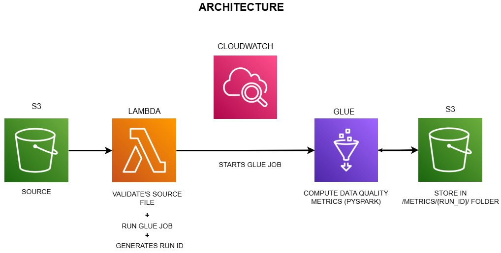

# AWS Event-Driven Data Quality Pipeline

## Overview

This project implements a serverless, event-driven data pipeline that processes CSV files uploaded to Amazon S3, computes data quality metrics using AWS Glue (PySpark), and stores results as metrics.json.

## Architecture





## Data Quality Metrics Stored
- Sample rows
- Numeric statistics (mean, std, min, max, etc.)
- Text statistics (distinct count, length, mode)
- Missing values & duplicates
- Outlier detection (IQR)
- Value distributions

## Project Setup

### Prerequisites
- AWS Account
- Python 3.10+
- boto3 (not strictly required if you use UI)

---

### S3 Structure

Bucket: `s3://aws-vista-lens`

Folders:
- `data/`
- `scripts/`
- `metrics/`

---

### IAM

#### Lambda Role
- `glue:StartJobRun`

#### Glue Role
- `AWSGlueServiceRole`
- S3 access (e.g., `AmazonS3FullAccess`)

#### IAM User (for setup via boto3)
- `glue:GetJob`
- `glue:CreateJob`
- `glue:StartJobRun`
- `iam:PassRole`

---

### S3 → Lambda Permission (IMPORTANT)

To allow S3 to trigger Lambda, you must add a **resource-based policy** to Lambda or in UI (s3 bucket properties -> Event notifications):

```python
lambda_client.add_permission(
    FunctionName="s3-trigger-fn",
    StatementId="s3invoke",
    Action="lambda:InvokeFunction",
    Principal="s3.amazonaws.com",
    SourceArn="arn:aws:s3:::aws-vista-lens"
)
```

### S3 Structure
Bucket: s3://aws-vista-lens

Folders:
- data/
- scripts/
- metrics/

---

### Lambda
- Validates CSV
- Generates run_id
- Triggers Glue

---

### Glue
- Reads CSV
- Computes metrics
- Writes JSON

---

## Output

s3://aws-vista-lens/metrics/<run_id>.json

---

## Testing

1. Upload CSV
2. Check Lambda logs
3. Check Glue run
4. Verify JSON output

---

## Future Work

- API layer
- Dashboards

---
